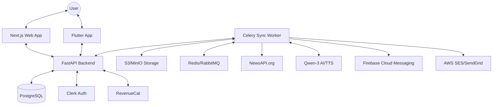

# System Design: HyPot-News Architecture

This document provides a comprehensive overview of the technical architecture, data flow, and technology stack for HyPot-News.

## 1. High-Level Architecture

The system follows a modern decoupled architecture with a centralized FastAPI backend serving both Web (Next.js) and Mobile (Flutter) clients.

---

## 2. Technology Stack

| Layer                 | Technology     | Purpose                                           |
| :-------------------- | :------------- | :------------------------------------------------ |
| **Frontend (Web)**    | Next.js        | Premium React framework for SEO and performance.  |
| **Frontend (Mobile)** | Flutter        | Cross-platform high-performance mobile UI.        |
| **Backend API**       | FastAPI        | High-performance asynchronous Python API.         |
| **Authentication**    | Clerk          | Managed identity and session management.          |
| **Database**          | PostgreSQL     | Relational data with JSONB for flexible metadata. |
| **Background Tasks**  | Celery + Redis | Asynchronous news syncing and processing.         |
| **Object Storage**    | S3 / MinIO     | Hosting HLS audio segments and site assets.       |
| **AI / NLP**          | Qwen-3 (LLM)   | Summarization and technical deep dives.           |
| **Audio (TTS)**       | Qwen-3 (TTS)   | Neural text-to-speech for news briefings.         |
| **Streaming**         | HLS (m3u8)     | Low-latency audio delivery via FFmpeg.            |
| **Payments**          | RevenueCat     | Subscription and entitlement management.          |
| **Notifications**     | FCM & SES      | Mobile push and email alerts.                     |

---

## 3. Core Component Pipelines

### 3.1 News Sync Engine (The Brain)
Triggered periodically via `POST /api/v1/news/sync`, this pipeline:
1.  **Ingestion**: Fetches the latest stories from NewsAPI based on world categories.
2.  **Summarization**: Qwen-3 LLM generates a 1-sentence headline and a 5-sentence summary.
3.  **TTS Generation**: Qwen-3 TTS renders the text into multiple voice profiles (e.g., Male Anchor, Female Assistant).
4.  **HLS Transcoding**: FFmpeg packages the audio into 6-second `.ts` segments for instant streaming.
5.  **Persistence**: References are stored in PG, and binary chunks are uploaded to S3.

### 3.2 Personalized Briefing Logic
When a user requests `GET /api/v1/news/briefing`:
1.  API fetches the user's `interests` and `preferred_volume` from PostgreSQL.
2.  Filters `news_articles` by category and timestamp.
3.  Calculates final HLS URLs by appending user preferences (voice, speed) to the base URLs.
4.  Returns a JSON array ready for the `BriefingSlider` UI.

---

## 4. Security & Data Integrity

- **JWT Validation**: All API requests carry a Clerk token, verified against Clerk's JWKS on the backend.
- **Webhook Parity**: Data from Clerk (User updates) and RevenueCat (Purchases) are verified using cryptographic signatures before updating the DB.
- **HLS Segment Security**: Audio playback uses short-lived signed URLs for premium content where required.

---

## 5. Related Documentation

- **[Audio Player Controls](./audio-player-ui.md)**
- **[Database Schema Reference](./db-schema.md)**
- **[Audio & HLS Details](./audio-processing.md)**
- **[Authentication Flow](./auth-profile.md)**
- **[Subscription Logic](./subscription-premium.md)**
- **[API Endpoints Index](./endpoints/news.md)**
